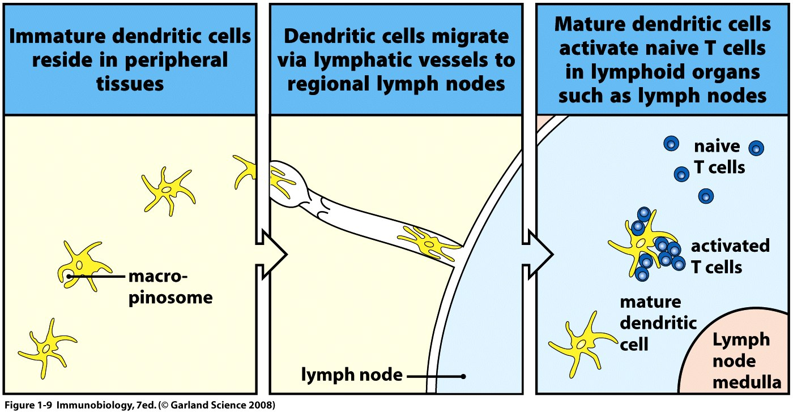
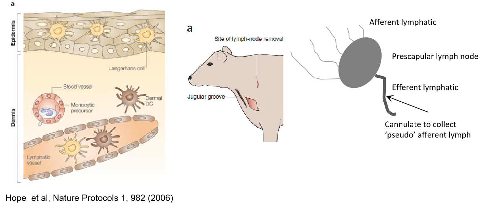
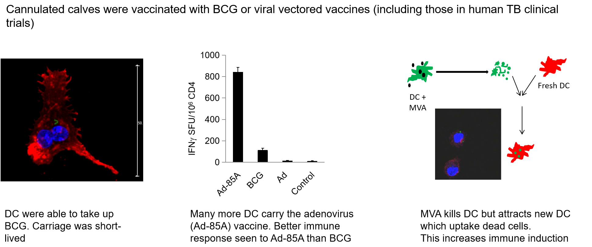
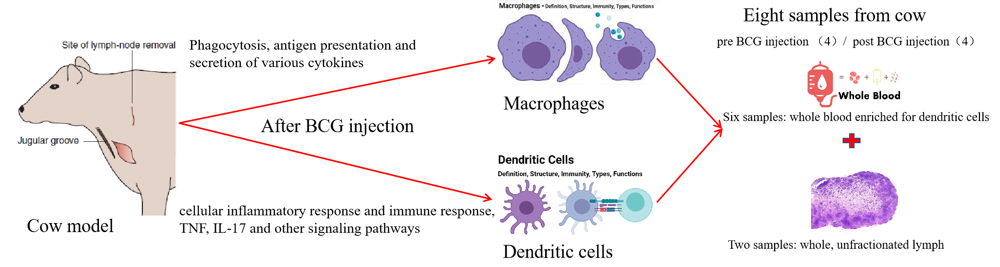
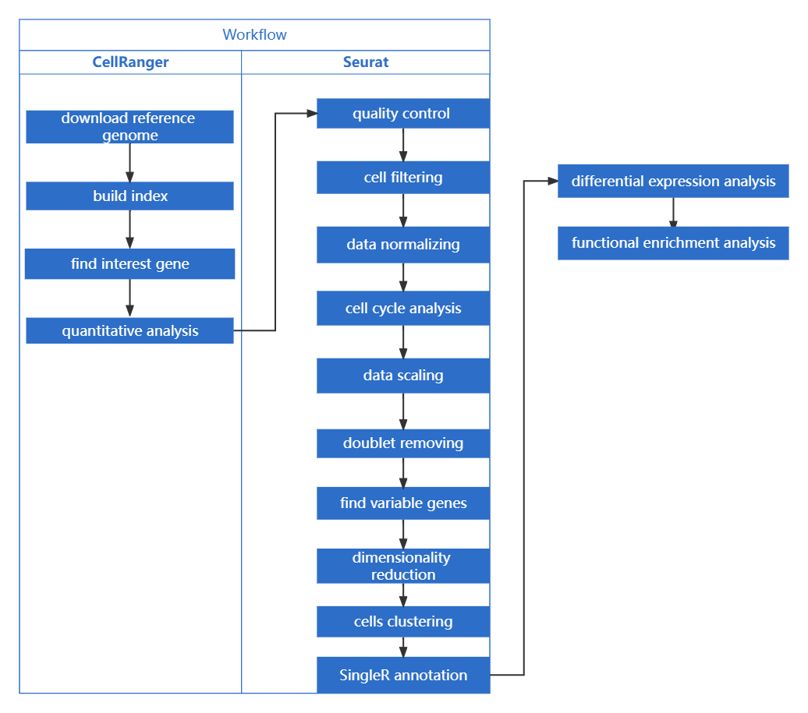

# Bioinformatic-analyses-of-single-cell-transcriptomic-data-describing-immune-cells-in-cattle

## Challenge
A major challenge we face in both veterinary and human medicine is that many of the diseases of interest including TB, are caused by intracellular pathogens where we know immunity relies on T cells. In most cases we don’t know how T cell immunity is induced, and this is particularly important for CD8+ cytotoxic T cells. The only licenced vaccine that induces and works via T cells is BCG.

Of course, we know that dendritic cells are central to this process, they underlie the body surfaces (the skin, mucosal surface of the gut and respiratory tract) where they sense danger = pathogens, inflammation as well as vaccines. They then carry signals away from the periphery trafficking in afferent lymphatic vessels towards the lymph node where they interact with T cells to switch on immune responses. If we can understand the early events that occur when dendritic cells move through the lymphatics, what genes and molecules they express, we can understand the early mechanisms by which T cells are switched on, and target these with new vaccines, or adjuvants to boost immunity.

## Identifying Mechanisms of Vaccine Induced Protection in vivo
In the first schematic we can see dendritic cells moving from the skin in the afferent lymphatics. In an ideal world we would access cells at this point for analysis. However, as you can see if the third picture here, each lymph node is served by numerous afferents that drain a large area of the skin – these vessels are tiny and impossible even in a large animal like a cow to surgically isolate for cell assessments. We have developed a surgical procedure where we remove a lymph node from the shoulder area of the cow (middle picture). The cow recovers from the surgery and over a period of 6-8 weeks all the tiny afferent vessels join or reanastomose with the single (larger) efferent lymphatic vessel. At second surgery, this vessel can be identified and a surgical cannula inserted. The cow then recovers from the surgery and we can collect the cells and signals that would normally drain from the skin – we can look at these cells in the normal animal, or after injection of vaccines etc. 

Two of our recent calves – surgical site, tubing connected to a cannula that is in the vessel shown on previous slide – cells collected in flask – we can look at these and ask what genes they express, what functions they have in the normal animal or we can put vaccines into the skin/muscle immediately above where the tubing comes from the skin and ask how the cells change – calves are happy and collect up to 28days, large of cells. Unique system as close to in vivo as we can get.

## Dendritic cells interact differently with bTB vaccine candidates
This work is applicable across a range of diseases but my main focus is on TB – increasing in the UK, major economic issue with unsatisfactory diagnostics and no current vaccines available for use. We know that BCG is a good vaccine especially when given to young calves and if we can understand why it works well, we can use that knowledge to design better vaccines that can be used in the field. 

We used the cannulation model to ask how TB candidate vaccines work. Here we compared BCG with other strategies that have been developed for human TB including adenoviral and MVA vectored vaccines that are, or have been in Phase 2b/3 human clinical trials. We showed that there are differences in carriage rates, in immune stimulation and in the way the immune response is switched on and then focussed. Adenoviral vaccine delivering the immunodominant antigen Ag85A were carried by many more dendritic cells compared to BCG, but they also induced much more T cells activity (measured here as IFNg expression, known to be key for immunity to TB). Interestingly MVA viral vector delivering the same antigen (Ag85A) killed dendritic cells – but it also attracted new dendritic cells to the lymph which took up the dying bits of cells and cross-presented these to CD8+ T cells to induce immunity. We now aim to extend this in our current studies by looking in detail at the gene signatures in different animals to further delve into the mechanisms of vaccine induced immunity.

## Project Background
Tuberculosis (TB) is a recurrent respiratory infectious disease resulting from the human body becoming infected with Mycobacterium tuberculosis. It continues to be a significant social and public health issue, seriously threatening people's health. Bovine tuberculosis (BTB), caused by Mycobacterium bovis, is also a dangerous disease, causing approximately US$3 billion economic losses yearly. Both Mycobacterium bovis and Mycobacterium tuberculosis, the human form, can cause tuberculosis in humans. The worldwide pandemic of tuberculosis has stimulated research into related treatments and vaccines. For the time being, Bacille Calmette-Guérin (BCG) is a vaccine that is widely used worldwide to prevent tuberculosis, while the immunisation effect of BCG is not satisfactory. One drawback of BCG is that the vaccine protects against tuberculosis in children but not adults, suggesting that BCG does not induce long-term protection. Currently, researchers hope to improve the immune effect and memory of BCG or develop new vaccines to address this issue. This makes the study of the principle of BCG immunity against Mycobacterium tuberculosis or Mycobacterium bovis an important research direction, which is the aim of this experiment. The immune response of BCG against tuberculosis is mainly initiated and controlled via the function of dendritic cells and macrophages. Mycobacterium tuberculosis or Mycobacterium bovis is the first to infect alveolar macrophages and BCG exerts its immune effect in the presence of dendritic cells. 

## Introduction
In this experiment, a bovine model's immunological response induced by macrophages and dendritic cells will be the main subject because cattle are also partially protected by BCG and are good models for human disease and vaccine studies. The experimental results can also be applied to humans. The samples we studied were including both dendritic cells subjected to fluorescence-activated cell sorting and immune cells from whole lymph nodes. By using bioinformatics packages such as CellRanger (version 2.2.0) and Seurat (version 2.3.4) to analyze the single cell transcriptomic data, we compared differentially expressed genes in dendritic cells and macrophages after BCG injection. We also looked for the relevant cellular pathways affected using enrichment analysis. The experimental results can provide guidance and insights for subsequent research on tuberculosis control methods and the development of novel vaccines.

## Raw data
The original data provided here is the data processed by cellranger.
-[Raw data](data/)

## Workflow
- Cell clustering (seurat and tSNE+UAMP)
- [Seurat](code/Seurat_1.R)
- Visualize marker genes
- [Cell annotation](code/cell_annotation_2.R)
- Differential gene set
- [DEG](code/diff_3.R)
- Functional annotation and visualization
- [Enrichment analysis](code/enrich_4.R)

